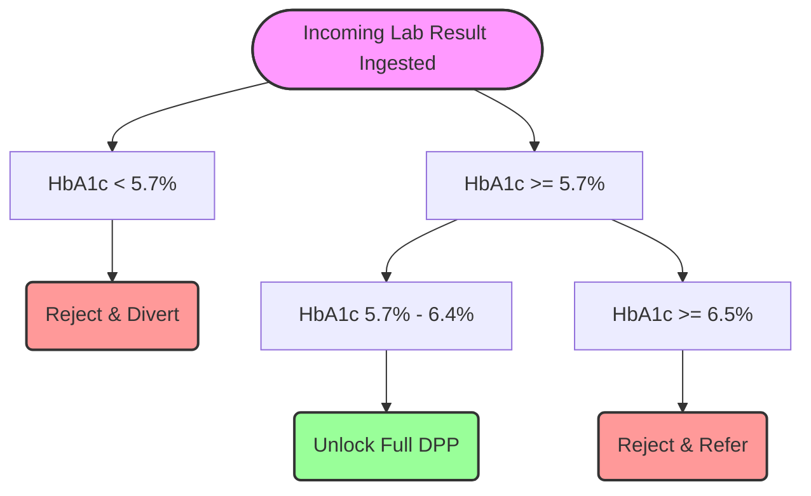
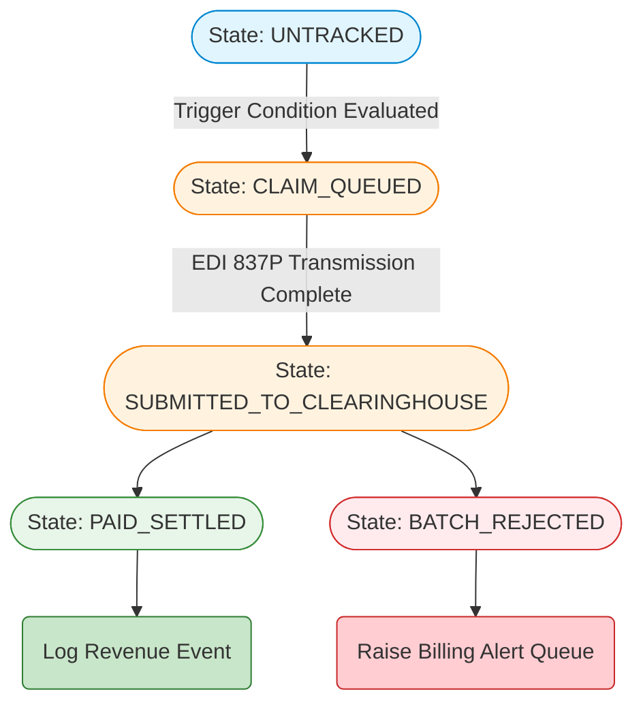
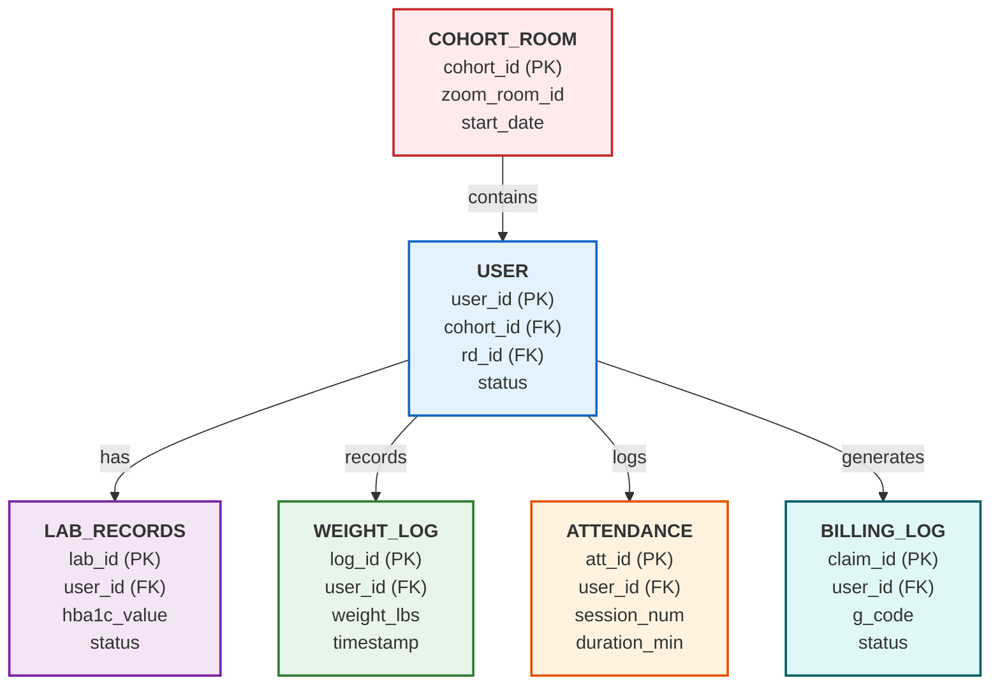
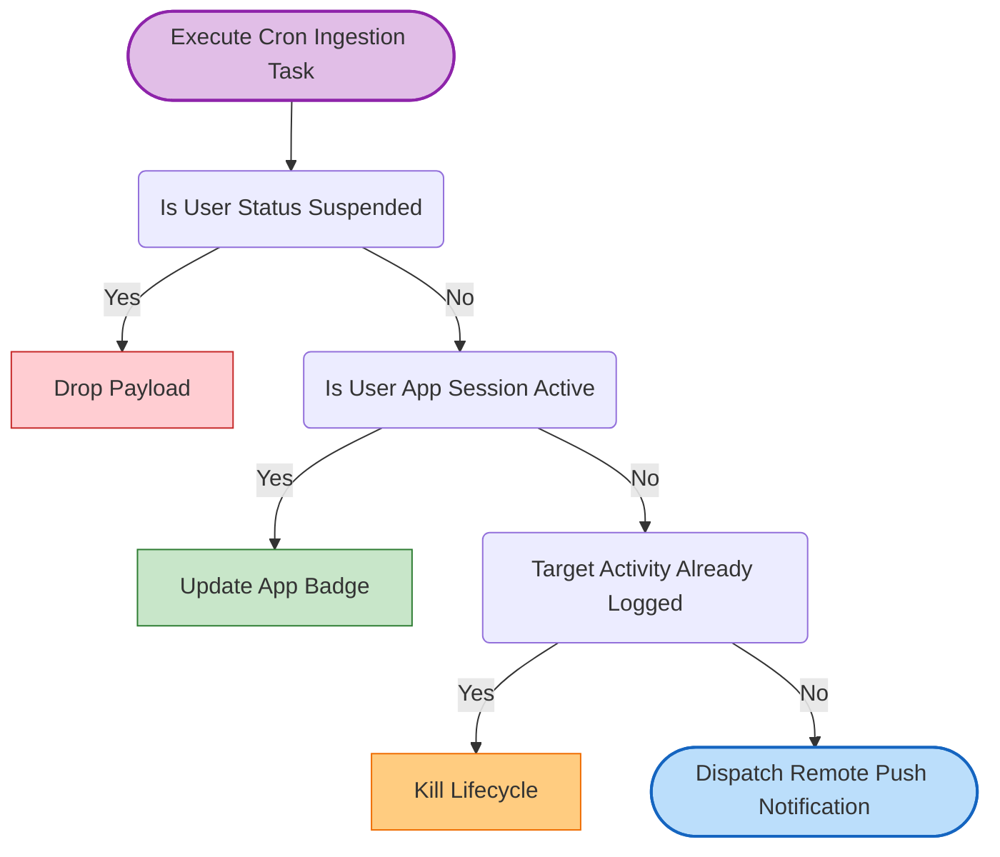

# BRAIN.MD — Decision Logic, Data Models & Governance
> Scope: Logic matrices, database relationships, and conditional rules for the platform.
> Constraint: Money-Back Outcome Guarantee logic is completely excluded.

---

## SECTION 1: CORE BIOMETRIC CLINICAL ROUTING

### 1.1 LabCorp HbA1c Eligibility Matrix
The platform employs strict conditional logic checks on incoming laboratory results to determine program entry or diversion.



* **Logic Specifications:**
    ```python
    def evaluate_hba1c_eligibility(user_id, hba1c_percentage):
        # Category 1: Normal glycemic profile (Ineligible)
        if hba1c_percentage < 5.7:
            set_user_registration_status(user_id, status="INELIGIBLE_NOT_PREDIABETIC")
            dispatch_routing_notification(user_id, template_id="REDIRECT_LOW_RISK")
            terminate_onboarding_lifecycle(user_id)
        
        # Category 2: Confirmed Prediabetes profile (Eligible for DPP)
        elif 5.7 <= hba1c_percentage <= 6.4:
            set_user_registration_status(user_id, status="ELIGIBILITY_VERIFIED")
            provision_cohort_allocation_queue(user_id)
            unlock_program_curriculum_access(user_id)
            
        # Category 3: Confirmed Diabetes profile (Outside preventive scope)
        elif hba1c_percentage >= 6.5:
            set_user_registration_status(user_id, status="INELIGIBLE_DIABETIC_DIAGNOSIS")
            dispatch_routing_notification(user_id, template_id="REDIRECT_CLINICAL_DIABETES")
            terminate_onboarding_lifecycle(user_id)
    ```

---

## SECTION 2: INSURANCE COMPLIANCE & CMS CLAIMS STATE MACHINE

### 2.1 Medicare G-Code Milestone Lifecycle Matrix
Claims processing operates on event-driven state transitions triggered when attendance milestones or weight loss targets are recorded in the database.

| G-Code Reference | Program Lifecycle Window | Definitive Trigger Condition | Transactional Action |
| :--- | :--- | :--- | :--- |
| **G9873** | Core Phase (Months 1-6) | `Core_Attendance_Count == 1` | Generates initial CMS enrollment claim payload. |
| **G9874** | Core Phase (Months 1-6) | `Core_Attendance_Count == 4` | Generates milestone 2 core claim file. |
| **G9875** | Core Phase (Months 1-6) | `Core_Attendance_Count == 9` | Generates milestone 3 core claim file. |
| **G9878** | Maintenance Phase (Months 7-12) | `Maintenance_Attendance == 3` AND `Current_Month` within [7, 8, 9] | Generates first maintenance phase interval claim. |
| **G9879** | Maintenance Phase (Months 7-12) | `Maintenance_Attendance == 3` AND `Current_Month` within [10, 11, 12] | Generates second maintenance phase interval claim. |
| **G9880** | Cumulative Target Window | `Weight_Loss_Percentage >= 5.00` calculated from the initial baseline weight | Generates outcomes-based performance bonus payment claim. |

### 2.2 Claims Lifecycle State Machine


---

## SECTION 3: CORE APPLICATION DATA SCHEMA

The database schema enforces standard relational structures to maintain clean separation of concerns across tracking, communication, and financial operations.



### 3.1 Structural Constraints
* **`USER` Isolation:** Holds system lifecycle states, onboarding parameters, and foreign key references to the assigned `COHORT_ROOM` and `DIETITIAN` tables.
* **`ATTENDANCE` Constraint Rules:** Every session attendance verification records the duration of the connection via Zoom server webhook integration. This structure provides audit trails required for CDC National DPP data submissions.
* **`WEIGHT_LOG` Constraint Rules:** Retains all raw scale readings along with accurate time-series metrics. The database evaluates new entries against the baseline reading to compute the current weight loss percentage used to trigger outcomes-based insurance claims.

---

## SECTION 4: SYSTEM BOUNDARY & DATA GOVERNANCE RULES

### 4.1 Automated Notification Dispatch Constraints
To prevent duplicate alerts and protect the member experience, the notification engine follows a priority checklist before dispatching reminders:



### 4.2 Security Boundaries & Privacy Constraints
* **Message Routing Access Controls:** Dietitians are isolated from cross-tenant user viewing through Row-Level Security (RLS) policies. The database restricts data access to ensure RDs can only query profiles that contain a matching `rd_id` reference.
* **PII Encryption Strategies:** Personally Identifiable Information (PII) including Insurance Card Member IDs, National Card Identifiers, and phone numbers are encrypted at the field level using cryptographically strong storage formats. These values are automatically masked within system application logging environments.
